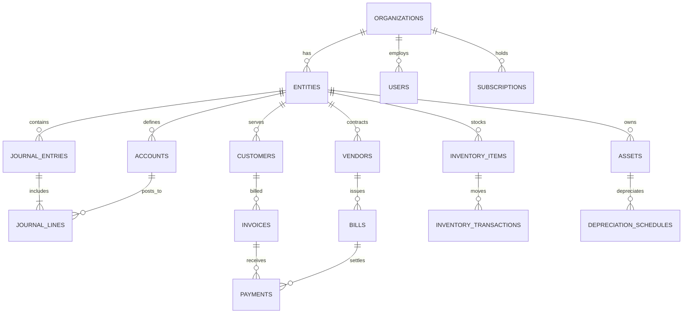
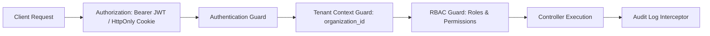
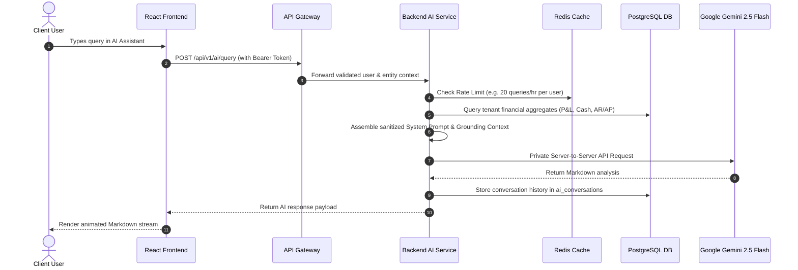

# FINAGROW — TARGET SYSTEM ARCHITECTURE SPECIFICATION
**Document Version:** 1.0.0 (Target Blueprint)  
**Status:** Approved for Future Implementation (Do Not Implement in Phase 0)  
**System Name:** FINAGROW Enterprise Financial Management & Growth Platform

---

## 1. Architectural Vision & System Goals

The target architecture for FINAGROW transitions the platform from a client-side prototype to a **secure, high-concurrency, multi-tenant financial SaaS platform**. 

The system guarantees:
- **Strict Double-Entry Bookkeeping Compliance (IFRS & SAK):** All balance mutations originate from validated, immutable, balanced journal entries.
- **Multi-Tenant & Multi-Entity Consolidation:** Organizations manage multiple subsidiaries/branches with independent charts of accounts, consolidated reporting, and cross-entity transactions.
- **Multi-Currency Engine:** Transactions recorded in native transaction currency with base currency conversions, FX gain/loss computations, and dynamic rate updates.
- **Enterprise-Grade Security & Zero-Trust Access Control:** Server-enforced Role-Based Access Control (RBAC), bcrypt/Argon2 password hashing, secure JWT/Session cookies, and granular audit logging.
- **Backend-Mediated AI Intelligence:** Google Gemini AI queries executed strictly server-side with context-aware RAG querying aggregated financial projections without exposing client secrets or leaking tenant data.

---

## 2. High-Level Architecture Topology

```mermaid
graph TD
    subgraph Client Layer
        WebClient[React 19 + TypeScript + Vite SPA]
        MobileWeb[Mobile Responsive View]
    end

    subgraph Edge & Security Layer
        WAF[Cloud WAF & DDoS Protection]
        APIGateway[API Gateway / Reverse Proxy - Nginx/Envoy]
        RateLimiter[Rate Limiter & CORS / Helmet]
    end

    subgraph Application Service Layer
        AuthSvc[Auth & User Service - JWT/RBAC]
        AccountingEngine[Double-Entry Ledger & COA Engine]
        CommercialSvc[Invoicing & Billing Subledger AR/AP]
        TreasurySvc[Cash & Bank Reconciliation Service]
        InventorySvc[Inventory & COGS Valuation Engine]
        AssetSvc[Fixed Asset & Depreciation Engine]
        TaxSvc[Tax Engine - PPN 11% / PPh / e-Faktur]
        AISvc[AI Financial Intelligence Proxy & RAG Engine]
        SubscriptionSvc[Subscription & Billing Webhook Handler]
    end

    subgraph Data & Storage Layer
        PostgreSQL[(PostgreSQL Relational DB - Multi-Tenant)]
        RedisCache[(Redis Cache & Session Store)]
        ObjectStorage[(S3-Compatible Document Storage - PDF/Receipts)]
    end

    subgraph External Integrations
        GeminiAPI[Google Gemini API]
        PaymentGateway[Midtrans / Stripe / Xendit]
        TaxAuthority[DJP Online e-Faktur Gateway]
    end

    Client Layer -->|HTTPS / WSS| Edge & Security Layer
    Edge & Security Layer --> Application Service Layer
    Application Service Layer --> PostgreSQL
    Application Service Layer --> RedisCache
    CommercialSvc --> ObjectStorage
    AssetSvc --> ObjectStorage
    AISvc -->|Private Server-Side Key| GeminiAPI
    SubscriptionSvc --> PaymentGateway
    TaxSvc --> TaxAuthority
```

---

## 3. Technology Stack Specification

| Component | Target Technology | Rationale |
| :--- | :--- | :--- |
| **Frontend** | React 19 + TypeScript + Vite | Preserves existing high-speed client architecture, reusable components, and dynamic UI. |
| **Styling & Design System** | Tailwind CSS (PostCSS build) + Lucide Icons | Clean, responsive design tokens with full light/dark mode support. |
| **Data Fetching & Cache** | TanStack Query (React Query) v5 | Server state caching, optimistic updates, query invalidation, and background refetching. |
| **Backend REST API** | Node.js (NestJS / Express) or Go (Gin/Fiber) | High throughput, strict architectural layering, dependency injection, and modular domain separation. |
| **ORM / Query Builder** | Prisma ORM or Drizzle ORM | Type-safe database queries, automated migrations, and schema drift prevention. |
| **Primary Database** | PostgreSQL 16+ | ACID transactions, robust foreign keys, row-level security (RLS), JSONB indexing, and financial numeric precision. |
| **In-Memory Cache & Queues** | Redis 7+ | Session management, rate limiting, and BullMQ background task processing (e.g. depreciation crons, report compilation). |
| **Blob / Object Storage** | AWS S3 or MinIO | Secure storage for invoice PDFs, vendor bills, asset documents, and user profile photos. |
| **AI Integration** | Google Gemini 2.5 Flash via Server-Side SDK | Direct API calls with private API keys stored in server environment variables only. |

---

## 4. Normalized Database Schema (Core Relational Models)



### Key Domain Tables & Field Definitions

```sql
-- 1. Organizations & Multi-Entity
CREATE TABLE organizations (
    id UUID PRIMARY KEY DEFAULT gen_random_uuid(),
    name VARCHAR(255) NOT NULL,
    plan VARCHAR(50) DEFAULT 'Starter', -- Starter, Pro, Enterprise
    created_at TIMESTAMP WITH TIME ZONE DEFAULT NOW(),
    updated_at TIMESTAMP WITH TIME ZONE DEFAULT NOW()
);

CREATE TABLE entities (
    id UUID PRIMARY KEY DEFAULT gen_random_uuid(),
    organization_id UUID NOT NULL REFERENCES organizations(id) ON DELETE CASCADE,
    code VARCHAR(50) NOT NULL,
    name VARCHAR(255) NOT NULL,
    functional_currency VARCHAR(3) DEFAULT 'IDR',
    tax_identification_number VARCHAR(100),
    is_active BOOLEAN DEFAULT TRUE,
    created_at TIMESTAMP WITH TIME ZONE DEFAULT NOW()
);

-- 2. Users, Authentication & RBAC
CREATE TABLE users (
    id UUID PRIMARY KEY DEFAULT gen_random_uuid(),
    organization_id UUID NOT NULL REFERENCES organizations(id) ON DELETE CASCADE,
    email VARCHAR(255) UNIQUE NOT NULL,
    password_hash VARCHAR(255) NOT NULL, -- Argon2id / bcrypt
    full_name VARCHAR(255) NOT NULL,
    phone_number VARCHAR(50),
    role VARCHAR(50) NOT NULL DEFAULT 'Viewer', -- Owner, Admin, Accountant, Auditor, Viewer
    status VARCHAR(50) DEFAULT 'Active', -- Active, Suspended, Invited
    avatar_url TEXT,
    created_at TIMESTAMP WITH TIME ZONE DEFAULT NOW(),
    updated_at TIMESTAMP WITH TIME ZONE DEFAULT NOW()
);

-- 3. Chart of Accounts (COA)
CREATE TABLE accounts (
    id UUID PRIMARY KEY DEFAULT gen_random_uuid(),
    entity_id UUID NOT NULL REFERENCES entities(id) ON DELETE CASCADE,
    code VARCHAR(50) NOT NULL,
    name VARCHAR(255) NOT NULL,
    type VARCHAR(50) NOT NULL, -- Asset, Liability, Equity, Revenue, Expense
    sub_category VARCHAR(100), -- Cash, AR, Inventory, Fixed Asset, AP, Tax Payable, etc.
    parent_account_id UUID REFERENCES accounts(id),
    currency VARCHAR(3) DEFAULT 'IDR',
    is_active BOOLEAN DEFAULT TRUE,
    created_at TIMESTAMP WITH TIME ZONE DEFAULT NOW(),
    UNIQUE(entity_id, code)
);

-- 4. Journal Entries & Journal Lines (Double-Entry Core)
CREATE TABLE journal_entries (
    id UUID PRIMARY KEY DEFAULT gen_random_uuid(),
    entity_id UUID NOT NULL REFERENCES entities(id) ON DELETE CASCADE,
    entry_number VARCHAR(100) NOT NULL,
    entry_date DATE NOT NULL,
    description TEXT NOT NULL,
    reference_type VARCHAR(50), -- INVOICE, BILL, PAYMENT, PAYROLL, ASSET_DEPRECIATION, MANUAL
    reference_id UUID,
    status VARCHAR(50) DEFAULT 'Posted', -- Draft, Posted, Voided
    created_by UUID REFERENCES users(id),
    created_at TIMESTAMP WITH TIME ZONE DEFAULT NOW(),
    UNIQUE(entity_id, entry_number)
);

CREATE TABLE journal_lines (
    id UUID PRIMARY KEY DEFAULT gen_random_uuid(),
    journal_entry_id UUID NOT NULL REFERENCES journal_entries(id) ON DELETE CASCADE,
    account_id UUID NOT NULL REFERENCES accounts(id),
    debit NUMERIC(18, 4) NOT NULL DEFAULT 0.0000,
    credit NUMERIC(18, 4) NOT NULL DEFAULT 0.0000,
    currency VARCHAR(3) DEFAULT 'IDR',
    exchange_rate NUMERIC(12, 6) DEFAULT 1.000000,
    base_debit NUMERIC(18, 4) NOT NULL DEFAULT 0.0000,
    base_credit NUMERIC(18, 4) NOT NULL DEFAULT 0.0000,
    memo TEXT,
    CONSTRAINT check_positive_debit CHECK (debit >= 0),
    CONSTRAINT check_positive_credit CHECK (credit >= 0),
    CONSTRAINT check_line_balance CHECK ((debit > 0 AND credit = 0) OR (credit > 0 AND debit = 0))
);

-- 5. Sub-ledgers: Invoices (AR) & Bills (AP)
CREATE TABLE customers (
    id UUID PRIMARY KEY DEFAULT gen_random_uuid(),
    entity_id UUID NOT NULL REFERENCES entities(id) ON DELETE CASCADE,
    name VARCHAR(255) NOT NULL,
    email VARCHAR(255),
    phone VARCHAR(50),
    tax_id VARCHAR(100),
    address TEXT
);

CREATE TABLE invoices (
    id UUID PRIMARY KEY DEFAULT gen_random_uuid(),
    entity_id UUID NOT NULL REFERENCES entities(id) ON DELETE CASCADE,
    customer_id UUID NOT NULL REFERENCES customers(id),
    invoice_number VARCHAR(100) NOT NULL,
    issue_date DATE NOT NULL,
    due_date DATE NOT NULL,
    subtotal NUMERIC(18, 2) NOT NULL,
    vat_rate NUMERIC(5, 2) DEFAULT 11.00,
    vat_amount NUMERIC(18, 2) DEFAULT 0.00,
    total_amount NUMERIC(18, 2) NOT NULL,
    status VARCHAR(50) DEFAULT 'Pending', -- Draft, Pending, Partially_Paid, Paid, Overdue, Cancelled
    journal_entry_id UUID REFERENCES journal_entries(id),
    created_at TIMESTAMP WITH TIME ZONE DEFAULT NOW()
);

CREATE TABLE vendors (
    id UUID PRIMARY KEY DEFAULT gen_random_uuid(),
    entity_id UUID NOT NULL REFERENCES entities(id) ON DELETE CASCADE,
    name VARCHAR(255) NOT NULL,
    contact_person VARCHAR(255),
    email VARCHAR(255),
    phone VARCHAR(50)
);

CREATE TABLE bills (
    id UUID PRIMARY KEY DEFAULT gen_random_uuid(),
    entity_id UUID NOT NULL REFERENCES entities(id) ON DELETE CASCADE,
    vendor_id UUID NOT NULL REFERENCES vendors(id),
    bill_number VARCHAR(100) NOT NULL,
    bill_date DATE NOT NULL,
    due_date DATE NOT NULL,
    subtotal NUMERIC(18, 2) NOT NULL,
    vat_rate NUMERIC(5, 2) DEFAULT 11.00,
    vat_amount NUMERIC(18, 2) DEFAULT 0.00,
    total_amount NUMERIC(18, 2) NOT NULL,
    status VARCHAR(50) DEFAULT 'Pending',
    journal_entry_id UUID REFERENCES journal_entries(id),
    created_at TIMESTAMP WITH TIME ZONE DEFAULT NOW()
);

-- 6. Inventory Valuation & Stock Layers (FIFO / AVCO)
CREATE TABLE inventory_items (
    id UUID PRIMARY KEY DEFAULT gen_random_uuid(),
    entity_id UUID NOT NULL REFERENCES entities(id) ON DELETE CASCADE,
    sku VARCHAR(100) NOT NULL,
    name VARCHAR(255) NOT NULL,
    category VARCHAR(100),
    unit VARCHAR(50) DEFAULT 'pcs',
    valuation_method VARCHAR(20) DEFAULT 'FIFO', -- FIFO, AVCO
    min_stock_alert INT DEFAULT 5,
    is_active BOOLEAN DEFAULT TRUE,
    UNIQUE(entity_id, sku)
);

CREATE TABLE inventory_layers (
    id UUID PRIMARY KEY DEFAULT gen_random_uuid(),
    inventory_item_id UUID NOT NULL REFERENCES inventory_items(id) ON DELETE CASCADE,
    quantity_received NUMERIC(14, 4) NOT NULL,
    quantity_remaining NUMERIC(14, 4) NOT NULL,
    unit_cost NUMERIC(18, 4) NOT NULL,
    received_date TIMESTAMP WITH TIME ZONE DEFAULT NOW(),
    reference_bill_id UUID REFERENCES bills(id)
);

-- 7. Fixed Assets & Depreciation
CREATE TABLE assets (
    id UUID PRIMARY KEY DEFAULT gen_random_uuid(),
    entity_id UUID NOT NULL REFERENCES entities(id) ON DELETE CASCADE,
    asset_code VARCHAR(100) NOT NULL,
    name VARCHAR(255) NOT NULL,
    category VARCHAR(100) NOT NULL,
    purchase_date DATE NOT NULL,
    purchase_cost NUMERIC(18, 2) NOT NULL,
    salvage_value NUMERIC(18, 2) DEFAULT 0.00,
    useful_life_years INT NOT NULL,
    depreciation_method VARCHAR(50) DEFAULT 'Straight Line',
    asset_account_id UUID REFERENCES accounts(id),
    accumulated_dep_account_id UUID REFERENCES accounts(id),
    dep_expense_account_id UUID REFERENCES accounts(id),
    status VARCHAR(50) DEFAULT 'Active'
);

-- 8. Audit Logs
CREATE TABLE audit_logs (
    id UUID PRIMARY KEY DEFAULT gen_random_uuid(),
    organization_id UUID NOT NULL,
    user_id UUID REFERENCES users(id),
    action VARCHAR(100) NOT NULL, -- CREATE, UPDATE, DELETE, POST_JOURNAL, EXPORT_REPORT
    entity_type VARCHAR(100) NOT NULL,
    entity_id UUID NOT NULL,
    ip_address VARCHAR(50),
    user_agent TEXT,
    old_values JSONB,
    new_values JSONB,
    created_at TIMESTAMP WITH TIME ZONE DEFAULT NOW()
);
```

---

## 5. Security & Authorization Architecture (RBAC)



### Role-Based Access Matrix

| Domain / Action | Owner | Admin | Accountant | Auditor | Standard User |
| :--- | :---: | :---: | :---: | :---: | :---: |
| **Manage Users & Roles** | ✅ | ✅ | ❌ | ❌ | ❌ |
| **Manage Billing & Plans** | ✅ | ✅ | ❌ | ❌ | ❌ |
| **Create/Edit COA** | ✅ | ✅ | ✅ | ❌ | ❌ |
| **Post Journal Entries** | ✅ | ✅ | ✅ | ❌ | ❌ |
| **Create Invoices / Bills** | ✅ | ✅ | ✅ | ❌ | ⚠️ (Draft only) |
| **Approve Payments & Transfers** | ✅ | ✅ | ✅ | ❌ | ❌ |
| **Run Payroll & Taxes** | ✅ | ✅ | ✅ | ❌ | ❌ |
| **View Financial Reports** | ✅ | ✅ | ✅ | ✅ | ⚠️ (Filtered) |
| **Access AI Assistant** | ✅ | ✅ | ✅ | ✅ | ✅ |
| **View Audit Logs** | ✅ | ✅ | ❌ | ✅ | ❌ |

---

## 6. Server-Side AI Architecture



### Security Measures for AI Service
1. **Zero Secret Exposure:** Google Gemini API Key resides strictly in backend `.env` variables or secret managers (e.g. AWS Secrets Manager, GCP Secret Manager).
2. **Tenant Data Isolation:** System queries only the requesting user's active `entity_id` and `organization_id`.
3. **Prompt Injection Defense:** Strict input sanitization and delimiter bounding.
4. **Rate Limiting:** Controlled per subscription plan (e.g. 50 prompts/day on Pro, unlimited on Enterprise).

---

## 7. Migration Readiness Checklist

When progressing from Phase 0 to future phases, ensure:
- [ ] Backend repository or monorepo workspace initialized.
- [ ] PostgreSQL database instance provisioned with connection pooling (`PgBouncer`).
- [ ] Authentication endpoints (`/api/v1/auth/login`, `/register`, `/refresh`, `/logout`) implemented with secure cookies.
- [ ] Frontend state hooks transitioned from `localStorage` to TanStack Query API consumers.
- [ ] Double-entry accounting triggers activated on all invoice and payment operations.
- [ ] Test coverage established for journal debit/credit balancing invariants.
