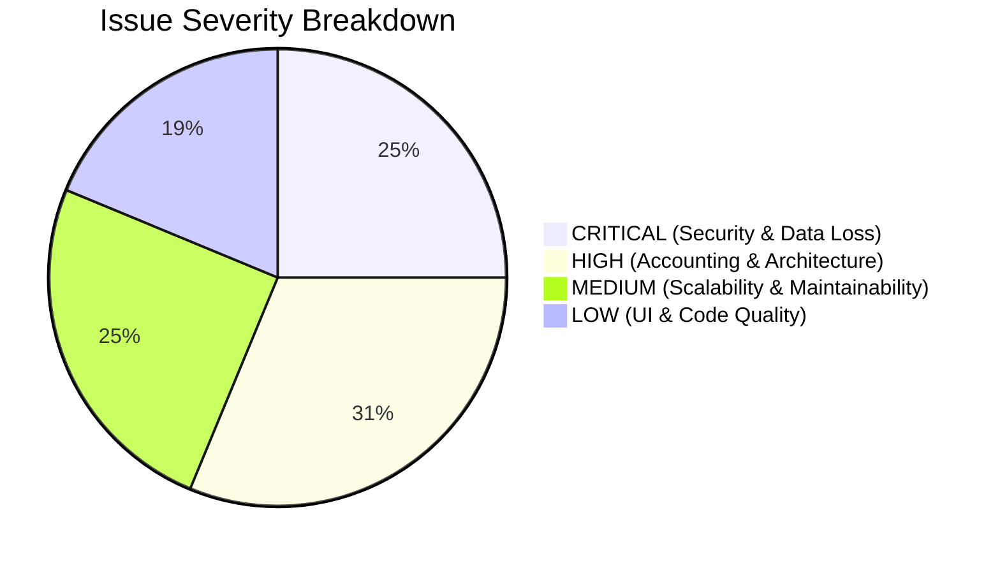
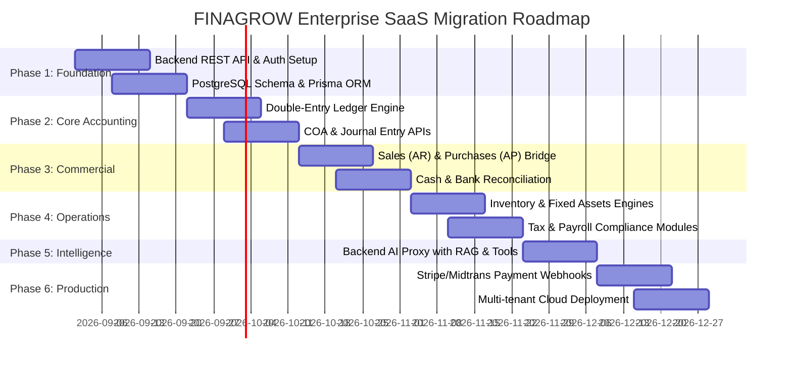

# FINAGROW (FMS Pro) — PROJECT AUDIT & SYSTEM STABILIZATION REPORT
**Document Version:** 1.0.0 (Phase 0 Audit)  
**Date:** August 30, 2026  
**Auditor:** Antigravity AI Engineering Team  
**Workspace:** `finagrow-main`

---

## 1. Executive Summary

FINAGROW is an all-in-one Financial Management System & Business Growth Platform designed for SMEs (UMKM) and mid-market enterprises. The current codebase represents a **rich, interactive client-side prototype** built with React 19, TypeScript, Vite, Tailwind CSS, Recharts, and Google Gemini GenAI SDK.

While the user interface, interaction flows, multi-language localization, and financial mockups are well-structured and visually cohesive, the application currently functions entirely as a **client-side Single Page Application (SPA)** with no backend API, no database, and no server-side security. All persistence relies on browser `localStorage` and `sessionStorage`.

This audit documents the current architecture, data model, accounting calculations, security posture, and a systematic roadmap for transitioning FINAGROW into a production-grade, multi-tenant enterprise SaaS platform.

---

## 2. Current Architecture Overview

```mermaid
graph TD
    Browser[Client Browser] --> App[React 19 + TypeScript SPA]
    App --> Router[React Router DOM v7]
    Router --> ProtectedRoute[Client ProtectedRoute Guard]
    ProtectedRoute --> Views[Module Views: Dashboard, GL, COA, Sales, Purchases, etc.]
    App --> FMSContext[FMSContext + useReducer State]
    App --> LangContext[LanguageContext (id/en)]
    App --> ThemeContext[ThemeContext (light/dark)]
    FMSContext --> LocalStorage[(Browser LocalStorage / SessionStorage)]
    Views --> GeminiClient[Direct @google/genai SDK Call]
    GeminiClient -->|process.env.GEMINI_API_KEY (Exposed in Bundle)| GoogleGemini[Google Gemini API]
```

### Technology Stack & Major Dependencies

| Category | Technology / Library | Version | Role in Project |
| :--- | :--- | :--- | :--- |
| **UI Framework** | React / React-DOM | `^19.1.1` | Core UI view layer |
| **Language** | TypeScript | `~5.8.2` | Static type checking (bundled with bundler resolution) |
| **Bundler & Dev Server** | Vite | `^6.2.0` | Build tool, HMR dev server |
| **Routing** | React Router DOM | `^7.18.0` | Client-side routing (`BrowserRouter`, `Routes`, `Route`) |
| **State Management** | React Context + `useReducer` | Native React | Global state container (`FMSContext`) |
| **Styling** | Tailwind CSS CDN + Vanilla CSS | CDN + Custom | Tailwind CSS loaded via CDN script with custom color tokens |
| **Icons** | Lucide React + Custom SVG | `^1.21.0` | Comprehensive UI iconography |
| **Data Visualization** | Recharts | `^3.2.1` | Interactive financial revenue & expense area charts |
| **Animations** | Motion (Framer Motion) | `^12.40.0` | Transitions & modal animations in AI Chatbot |
| **AI Integration** | `@google/genai` SDK | `^1.21.0` | Direct client-side Gemini 2.5 Flash API calls |

---

## 3. Current Folder Structure

```
finagrow-main/
├── .gitignore                    # Git ignore configurations
├── App.tsx                       # Root application shell, routing configuration, layout wrapper
├── index.html                    # HTML entrypoint, Tailwind CDN script, and metadata
├── index.tsx                     # React DOM root render mount
├── index.css                     # Global base styles (stabilized during Phase 0)
├── metadata.json                 # Project descriptor and tags
├── package.json                  # Dependencies and run scripts
├── package-lock.json             # NPM lockfile
├── tsconfig.json                 # TypeScript compiler configuration
├── vite.config.ts                # Vite build configuration, aliases, and env definitions
├── types.ts                      # Core TypeScript definitions and data interfaces
│
├── components/                   # UI Modules & Component Views (29 files)
│   ├── AIChatBot.tsx             # Interactive floating AI Financial Assistant modal
│   ├── Accounts.tsx              # Chart of Accounts (COA) management module
│   ├── Assets.tsx                # Fixed Assets registry and depreciation tracker
│   ├── Auth.tsx                  # Sign In, Registration, and Demo login screen
│   ├── Budgeting.tsx             # Departmental and account budgeting allocations
│   ├── CashBank.tsx              # Cash & Bank accounts, internal transfers, and cash flow
│   ├── Dashboard.tsx             # Executive financial overview, KPI stat cards, charts
│   ├── Entities.tsx              # Multi-entity & corporate branch manager
│   ├── GeneralLedger.tsx         # Journal Entries & General Ledger stream
│   ├── Header.tsx                # Top navigation bar, entity switcher, profile trigger
│   ├── Inventory.tsx             # Stock management, SKU tracking, valuation metrics
│   ├── LandingPage.tsx           # Marketing landing page, features showcase, hero section
│   ├── Payroll.tsx               # Payroll run schedules, gross/net disbursements
│   ├── Profile.tsx               # User account profile, avatar upload, and security settings
│   ├── ProjectDetailModal.tsx    # Modal for inspecting project financials
│   ├── Projects.tsx              # Project budgeting and profitability monitor
│   ├── Purchases.tsx             # Vendor bills (AP), expense tracking, bill creation
│   ├── RecentTransactions.tsx    # Compact transaction list table for dashboard
│   ├── Reports.tsx               # Financial statements (P&L, Balance Sheet, Cash Flow, Aging)
│   ├── RevenueChart.tsx          # Recharts revenue vs. expenses visualization
│   ├── Sales.tsx                 # Customer invoices (AR), receivables tracking
│   ├── Settings.tsx              # System configurations, modules toggles, general preferences
│   ├── Sidebar.tsx               # Collapsible desktop sidebar navigation
│   ├── StatCard.tsx              # Reusable KPI metric card
│   ├── Subscription.tsx          # Subscription plans & upgrade modal
│   ├── Tax.tsx                   # VAT (PPN 11%) and PPh tax ledger & reporting
│   ├── TransactionDetailModal.tsx# Detailed transaction drawer modal
│   ├── Users.tsx                 # Team & user management (RBAC administration)
│   ├── Vendors.tsx               # Vendor directory & accounts payable balances
│   └── icons/                    # Custom SVG icon wrapper components
│       └── IconComponents.tsx
│
├── context/                      # State Context Providers
│   ├── FMSContext.tsx            # Monolithic global state, seed datasets, reducer actions
│   └── LanguageContext.tsx       # Indonesian (id) & English (en) localization provider
│
├── hooks/                        # Custom React Hooks
│   ├── useLocalization.ts        # Helper hook for translation strings `t(key)`
│   └── useTheme.ts               # Light/Dark mode state hook
│
├── localization/                 # Multilingual Dictionary
│   └── translations.ts           # Dual-language translations (Indonesian & English)
│
└── services/                     # Third-Party & API Integrations
    └── geminiService.ts          # Direct Google Gemini SDK invocation wrapper
```

---

## 4. Current Data Model (`types.ts`)

The application models its domain in `types.ts` and component-level interfaces:

### Core Interfaces

```typescript
// System modules toggle flags
export interface FMSModules {
  [key: string]: boolean;
  dashboard: boolean;
  transactions: boolean;
  invoices: boolean;
  cashbank: boolean;
  budgeting: boolean;
  tax: boolean;
  assets: boolean;
  inventory: boolean;
  coa: boolean;
  entities: boolean;
  users: boolean;
  settings: boolean;
}

// Multi-Entity / Company Branch
export interface Entity {
  id: string;
  code: string;
  name: string;
  currency: 'IDR' | 'USD';
}

// Chart of Accounts (COA) Account
export interface COAAccount {
  id: string;
  code: string;
  name: string;
  type: 'Asset' | 'Liability' | 'Equity' | 'Revenue' | 'Expense';
  description?: string;
  parentAccountId?: string;
  openingBalance?: number;
}

// Budget allocation
export interface Budget {
  id: string;
  accountId: string;
  period: string; // e.g. "2026-08"
  amount: number;
  entity: string;
}

// General Transaction / Journal Entry
export interface Transaction {
  id: string;
  description: string;
  amount: number;
  date: string;
  type: 'income' | 'expense';
  category: string;
  status: 'Completed' | 'Pending' | 'Cancelled';
  vendor?: string;
  customer?: string;
  paymentMethod?: string;
  notes?: string;
  entity?: string;
  dr: string; // Debit account code/ID
  cr: string; // Credit account code/ID
  cur?: string;
}

// Invoices & Bills (AR / AP)
export interface Invoice {
  id: string;
  invoiceNumber: string;
  customer: {
    name: string;
    email: string;
  };
  issueDate: string;
  dueDate: string;
  amount: number;
  status: 'Paid' | 'Pending' | 'Overdue';
  entity?: string;
  type?: 'AR' | 'AP';
  party?: string;
  desc?: string;
  vat?: number;
  cur?: string;
}

// Project Financials
export interface Project {
  id: string;
  name: string;
  customer: string;
  budget: number;
  spent: number;
  progress: number;
  status: 'In Progress' | 'Completed' | 'On Hold' | 'Cancelled';
  profitability: number;
  entity?: string;
}

// Vendor
export interface Vendor {
  id: string;
  name: string;
  contactPerson: string;
  email: string;
  phone: string;
  outstandingBalance: number;
}

// Payroll Run
export interface PayrollRun {
  id: string;
  payPeriod: string;
  runDate: string;
  totalGross: number;
  totalTaxes: number;
  totalNet: number;
  status: 'Completed' | 'In Progress' | 'Scheduled';
}

// Global Application State
export interface FMSState {
  version: string;
  currency: 'IDR' | 'USD' | 'EUR';
  lang: 'id' | 'en';
  theme: 'light' | 'dark';
  role: string;
  activeEntity: string;
  activePeriod: string;
  currentView?: string;
  modules: FMSModules;
  entities: Entity[];
  users: any[];
  coa: COAAccount[];
  transactions: Transaction[];
  invoices: Invoice[];
  budgets: Budget[];
  assets: any[];
  inventory: any[];
  projects: Project[];
  vendors: Vendor[];
  payrollRuns: PayrollRun[];
  currentUserEmail?: string;
  subscription?: 'Free' | 'Pro';
  notifications?: NotificationItem[];
}
```

---

## 5. Current State Management & Reducer

The application state is managed by a single monolithic React Context: `FMSContext.tsx`.

### Reducer Actions Supported

| Action Type | Payload Type | Description |
| :--- | :--- | :--- |
| `SET_STATE` | `FMSState` | Replaces the entire state object |
| `LOGIN_USER` | `{ email, stateData }` | Initializes user state and loads global module permissions |
| `LOGOUT_USER` | `void` | Resets state to default unauthenticated state |
| `SET_SUBSCRIPTION` | `'Free' \| 'Pro'` | Toggles subscription tier |
| `SET_VIEW` | `string` | Updates current navigation view |
| `TOGGLE_MODULE` | `{ key, value }` | Enables/disables individual system modules |
| `ADD_TRANSACTION` / `EDIT_` / `DELETE_` | `Transaction` | Mutates transaction list and creates notification |
| `ADD_INVOICE` / `EDIT_` / `DELETE_` | `Invoice` | Mutates invoice/bill list |
| `ADD_COA_ACCOUNT` / `EDIT_` / `DELETE_` | `COAAccount` | Mutates Chart of Accounts |
| `ADD_ENTITY` / `EDIT_` / `DELETE_` | `Entity` | Mutates entity/company branch list |
| `ADD_BUDGET` / `EDIT_` / `DELETE_` | `Budget` | Mutates budget allocations |
| `ADD_ASSET` / `EDIT_` / `DELETE_` | `Asset` | Mutates fixed asset records |
| `ADD_INVENTORY_ITEM` / `EDIT_` / `DELETE_` | `InventoryItem` | Mutates inventory items |
| `ADD_USER` / `EDIT_` / `DELETE_` | `User` | Mutates team members list |
| `ADD_VENDOR` / `EDIT_` / `DELETE_` | `Vendor` | Mutates vendor records |
| `ADD_PROJECT` | `Project` | Adds project record |
| `ADD_NOTIFICATION` / `MARK_NOTIFICATION_READ` / `DELETE_NOTIFICATION` | `NotificationItem` | Manages live in-app notifications |

### State Initialization & Synchronization Mechanism

1. **User-Scoped State Loading:** On mount, `FMSProvider` checks `localStorage.getItem('fms_active_user_email')`. If found, it parses `fms_state_user_${activeEmail}`.
2. **Seed State Fallbacks:** If a user logs in for the first time, `getSeededStateForUser(email, role)` provides enterprise seed data for Admin roles (e.g. `mochamadraflyrasyidin@gmail.com`, `demo_admin@fms.com`) or SME/retail seed data for standard users.
3. **Continuous Write-back:** An `useEffect` listening to `[state]` serializes the complete state JSON into `localStorage` on every change.

---

## 6. Current Authentication & Authorization

### How Authentication Currently Operates

1. **User Database:** Maintained in `localStorage.getItem('fms_registered_users')`.
   - Default seeded accounts:
     * `demo_admin@fms.com` (Password: `123456`, Role: `Admin`)
     * `demo_user@fms.com` (Password: `123456`, Role: `User`)
     * `demo@fms.com` (Password: `123456`, Role: `Admin`)
     * `andi@bellcorp.com` (Password: `123456`, Role: `User`)
     * `sari@bellcorp.com` (Password: `123456`, Role: `User`)
2. **Registration:** `Auth.tsx` appends a new user object `{ name, phone, email, password, status: 'Active' }` to the `fms_registered_users` array.
3. **Login:** Compares input email and password against the array in `localStorage`.
4. **Session Guard:** `ProtectedRoute` in `App.tsx` checks `if (!state.currentUserEmail) return <Navigate to="/login" replace />`.
5. **Ban Check:** Checks if `user.status === 'Banned'` or `user.isBanned === true` in state or localStorage. If banned, displays a suspension banner.

---

## 7. Current Persistence Reference

Every key utilized in `localStorage` and `sessionStorage`:

| Storage Key | Storage Type | Purpose | Security / Integrity Risk |
| :--- | :--- | :--- | :--- |
| `fms_active_user_email` | `localStorage` | Identifies currently active logged-in user email | Plaintext, easily forged to switch accounts |
| `fms_state_user_{email}` | `localStorage` | Complete user data tree (COA, transactions, invoices, etc.) | High risk of data loss on browser clear; 5-10MB quota limit |
| `fms_state_react_v1` | `localStorage` | Fallback guest/global state if no user email is active | Unencrypted full state tree |
| `fms_registered_users` | `localStorage` | Array of registered user accounts and credentials | **CRITICAL:** Stores passwords in plaintext (`password: "123456"`) |
| `fms_global_modules` | `localStorage` | Admin's module toggle configuration shared across users | Client-side writable |
| `fms_profile_fields_{email}` | `localStorage` | Profile metadata (phone, department, company) | Unsynchronized with backend |
| `fms_avatar_{email}` | `localStorage` | Base64-encoded user profile picture string | Large images cause localStorage quota overflow |
| `fms_pro_chat_history_v2` | `sessionStorage` | Chat conversation messages with FINAGROW AI | Persists until tab is closed |
| `language` | `localStorage` | User language preference (`'id'` or `'en'`) | Low risk |

---

## 8. Current AI Integration Architecture

### Invocation Flow
- Triggered from `AIChatBot.tsx` via the floating robot button.
- Calls `getAIFinancialAdvice(prompt, context)` in `services/geminiService.ts`.
- Uses `@google/genai` SDK:
  ```typescript
  const API_KEY = process.env.API_KEY;
  const ai = new GoogleGenAI({ apiKey: API_KEY });
  const response = await ai.models.generateContent({
    model: 'gemini-2.5-flash',
    contents: fullPrompt,
    config: { temperature: 0.5, topP: 0.95 }
  });
  ```
- The context payload is dynamically calculated on the client:
  - Formatted Total Revenue, Expenses, Net Profit
  - Cash & Bank balance aggregation
  - Accounts Receivable & Accounts Payable balances
  - Top active projects & inventory count

### Critical Security Flaw Identified
In `vite.config.ts`:
```typescript
define: {
  'process.env.API_KEY': JSON.stringify(env.GEMINI_API_KEY),
  'process.env.GEMINI_API_KEY': JSON.stringify(env.GEMINI_API_KEY)
}
```
**The Gemini API Key is bundled into the client-side JavaScript artifact (`dist/assets/*.js`). Anyone inspecting browser network traffic or source code can extract this secret key.**

---

## 9. Current Subscription & Feature Restriction Architecture

- Plans defined in `components/Subscription.tsx`:
  1. **Starter** (Rp 150k/mo): Max 100 tx/mo, 1 User, Standard Reports.
  2. **Professional / Pro** (Rp 450k/mo): Unlimited tx, 5 Users, Payroll, Inventory, AI Assistant.
  3. **Enterprise** (Rp 1.5M/mo): Multi-entity consolidation, Unlimited Users, Custom roles.
- Enforcement: Checked client-side via `state.subscription === 'Pro'`.
- Locked features (e.g., `Inventory.tsx`, `Payroll.tsx`, mobile more menu items) display a backdrop blur overlay with a lock icon.
- **Vulnerability:** Any user can open Developer Tools and dispatch `{ type: 'SET_SUBSCRIPTION', payload: 'Pro' }` or edit their localStorage record to unlock Pro features without paying.

---

## 10. Current Accounting Logic vs. Target Accounting Engine

| Accounting Domain | Current Prototype Logic | Target Accounting Logic (Production) |
| :--- | :--- | :--- |
| **Revenue Calculation** | Sum of `transactions` where `type === 'income' && status === 'Completed'`. | Accrual basis: Sum of Credit balances in Revenue accounts (`4000-4999`) derived from validated General Ledger journal entries across closed/open accounting periods. |
| **Expense Calculation** | Sum of `transactions` where `type === 'expense' && status === 'Completed'`. | Accrual basis: Sum of Debit balances in Expense accounts (`5000-6999`) derived from validated General Ledger journal entries. |
| **Net Profit** | `totalRevenue - totalExpenses` computed in-memory in `Dashboard.tsx`. | Formal Multi-step Income Statement: Gross Profit = Net Revenue - COGS; Operating Income = Gross Profit - OPEX; Net Income = Operating Income - Taxes & Interest. |
| **Cash & Bank Balance** | Sum of `1001` (Petty Cash) + `1002` (BCA) + `1003` (Mandiri) balances derived from `openingBalance + (debits - credits)`. | Asset account ledger balance verified through automated and manual Bank Reconciliation matching bank feeds/statements with GL Cash accounts. |
| **Accounts Receivable (AR)** | Invoices of `type === 'AR'` listed in `Sales.tsx`. Does **NOT** automatically write to General Ledger transactions. | Invoicing triggers double-entry: `Dr. Accounts Receivable (1100) / Cr. Revenue (4000) + Cr. Tax Output (2100)`. Payment receipt triggers `Dr. Bank (1002) / Cr. Accounts Receivable (1100)`. Subledger must reconcile with GL Account 1100. |
| **Accounts Payable (AP)** | Bills of `type === 'AP'` listed in `Purchases.tsx`. Does **NOT** automatically write to General Ledger transactions. | Bill receipt triggers `Dr. Expense / Inventory / Cr. Accounts Payable (2000) + Dr. Tax Input (1150)`. Payment triggers `Dr. Accounts Payable (2000) / Cr. Bank (1002)`. Subledger must reconcile with GL Account 2000. |
| **Inventory Valuation** | Flat multiplication: `sum(item.quantity * item.unitCost)`. Valuation method selector (`FIFO`, `AVCO`, `LIFO`) has no computational impact. | Perpetual inventory accounting maintaining inventory layers/lots. Purchase updates moving average or FIFO queues. Sales trigger automated COGS entry: `Dr. Cost of Goods Sold (5000) / Cr. Inventory (1200)`. |
| **Fixed Assets & Depreciation** | Mathematical estimation on component load: `purchaseCost / usefulLifeMonths * monthsElapsed`. Does not create journal entries. | Asset register linked to GL. Monthly automated depreciation cron: `Dr. Depreciation Expense (5400) / Cr. Accumulated Depreciation (1510)`. Fixed asset disposal and impairment ledger workflows. |
| **Tax (PPN 11% & PPh)** | Calculates VAT from invoice records with `vat > 0`: `Output VAT = AR * vat%`, `Input VAT = AP * vat%`. `Net VAT = Output - Input`. | Tax accounts in GL: Tax Output (PPN Keluaran - 2100) and Tax Input (PPN Masukan - 1150). Automated generation of e-Faktur compliant CSVs, PPh 21 employee withholding, and PPh 23 vendor tax deductions. |
| **Multi-Currency** | Transactions carry a `cur` string tag (`'IDR'`, `'USD'`). Amounts are summed without real-time or historical FX conversion. | Functional currency base ledger with multi-currency journal entries storing transactional amount, exchange rate, and base currency equivalent. Realized and unrealized FX gain/loss automated posting. |

---

## 11. Identified Problems & Severity Matrix



### A. CRITICAL SEVERITY

1. **Client-Side Gemini API Key Leak:**
   - *Issue:* `vite.config.ts` passes `env.GEMINI_API_KEY` directly to the client bundle via `define`.
   - *Impact:* Attackers can extract the key, incur costs on the user's Google Cloud account, and abuse the quota.
2. **Plaintext Passwords in Browser Storage:**
   - *Issue:* `fms_registered_users` stores plaintext passwords (`123456`).
   - *Impact:* Anyone with physical or script access to the browser can read all user passwords.
3. **No Server-Side Authentication & Authorization:**
   - *Issue:* Auth is simulated via localStorage. Any user can manipulate `currentUserEmail` or `role` to elevate privileges to `Admin`.
4. **Data Volatility & Loss Risk:**
   - *Issue:* All financial transactions, invoices, and assets live exclusively in browser `localStorage`. Clearing browser data or changing browsers permanently deletes company financial records.

### B. HIGH SEVERITY

1. **Sub-ledger to General Ledger Disconnect:**
   - *Issue:* Invoices created in `Sales.tsx` and bills created in `Purchases.tsx` are appended to `state.invoices` but do not generate corresponding balanced double-entry transactions in `state.transactions`.
   - *Impact:* Financial statements and Dashboard GL metrics do not accurately reflect invoice creation or settlements.
2. **Single Debit/Credit Transaction Simplification:**
   - *Issue:* The `Transaction` model only supports 1 debit account and 1 credit account (`dr`, `cr`).
   - *Impact:* Complex multi-line transactions (e.g. Sales with PPN tax, Compound expenses, Split payments) cannot be correctly recorded without multiple disconnected entries.
3. **Monolithic State & Concurrent Modification:**
   - *Issue:* Updating any module rewrites the entire `FMSState` blob to `localStorage`.
   - *Impact:* High risk of state overwrites and impossible multi-user real-time collaboration.
4. **Unenforced Subscriptions:**
   - *Issue:* Pro features are gated by client-side boolean checks (`state.subscription === 'Pro'`).
5. **No Period Lock & Audit Trail:**
   - *Issue:* Users can edit or delete past transactions without immutable journal logs, violating accounting audit compliance standards (SAK / IFRS).

### C. MEDIUM SEVERITY

1. **Static Inventory Valuation:**
   - *Issue:* Valuation is static `quantity * unitCost` without real lot-based FIFO or weighted average cost tracking upon sales dispatch.
2. **Depreciation Calculation Disconnected from Books:**
   - *Issue:* Asset depreciation is calculated on-the-fly inside the `Assets.tsx` view and does not post monthly depreciation journal entries.
3. **LocalStorage 5MB Quota Limit:**
   - *Issue:* Storing Base64 avatars and large transaction histories will quickly trigger `QuotaExceededError`.
4. **Missing Exchange Rate Conversion Table:**
   - *Issue:* USD and IDR transactions exist in the same database without real-time FX normalization.

### D. LOW SEVERITY

1. **Duplicate Helper Functions:**
   - *Issue:* `formatCurrency`, `today()`, `daysAgo()` are re-declared across 15+ component files instead of being shared via a central utility.
2. **Loose Type Definitions (`any[]`):**
   - *Issue:* `users: any[]`, `assets: any[]`, `inventory: any[]` in `types.ts` reduce TypeScript safety.
3. **CDN Tailwind Dependency:**
   - *Issue:* Relies on external CDN `<script src="https://cdn.tailwindcss.com"></script>` at runtime rather than compiled PostCSS/Tailwind build.

---

## 12. Audit & Stabilization Actions Taken in Phase 0

| Item | Status | Result |
| :--- | :--- | :--- |
| **Dependencies & Installation** | Verified | Installed 155 npm packages cleanly via `npm install`. |
| **TypeScript Type Checking** | Verified | `npm run lint` (`tsc --noEmit`) passes with **0 errors**. |
| **Vite Production Build** | Verified | `npm run build` succeeds and produces production bundle in `dist/`. |
| **Missing Asset Warning Fix** | Fixed | Created `index.css` to eliminate Vite runtime 404/build warning. |
| **Feature Preservation** | Verified | All 23 modules, Landing Page, Auth flows, Demo Accounts, AI Assistant, Theme switching, and Dual-Language localization remain 100% operational. |

---

## 13. Recommended Migration Roadmap (Phase 1 to Phase 6)



- **Phase 1: Backend Foundation & Secure Authentication**
  - Implement Node.js (NestJS or Express) / Go / Python backend.
  - Set up PostgreSQL relational database with Prisma or Drizzle ORM.
  - Implement JWT authentication with HttpOnly secure cookies, bcrypt password hashing, and server-side RBAC.
- **Phase 2: Core Double-Entry Accounting Engine**
  - Create normalized tables for `accounts`, `journal_entries`, and `journal_lines`.
  - Enforce atomic transactions: Sum(Debits) == Sum(Credits).
  - Implement Period Lock and Immutable Audit Trail.
- **Phase 3: Sub-ledger Integration (AR, AP, Cash/Bank)**
  - Integrate Invoices (AR) and Bills (AP) directly into the GL posting pipeline.
  - Build automated bank reconciliation workflow.
- **Phase 4: Operational Engines (Inventory, Assets, Tax, Payroll)**
  - Implement FIFO/AVCO inventory lot tracking with automated COGS posting.
  - Implement automated monthly asset depreciation cron jobs.
  - Implement PPN 11% and PPh withholding tax calculators.
- **Phase 5: Secure AI Financial Intelligence Service**
  - Move Gemini integration behind a secure server-side API proxy (`/api/v1/ai/query`).
  - Implement contextual RAG querying database aggregates rather than sending raw frontend arrays.
- **Phase 6: Multi-tenancy, Subscription Billing & Production Launch**
  - Implement multi-tenant schema isolation.
  - Integrate payment gateway (Midtrans / Xendit / Stripe) with webhook verification.
