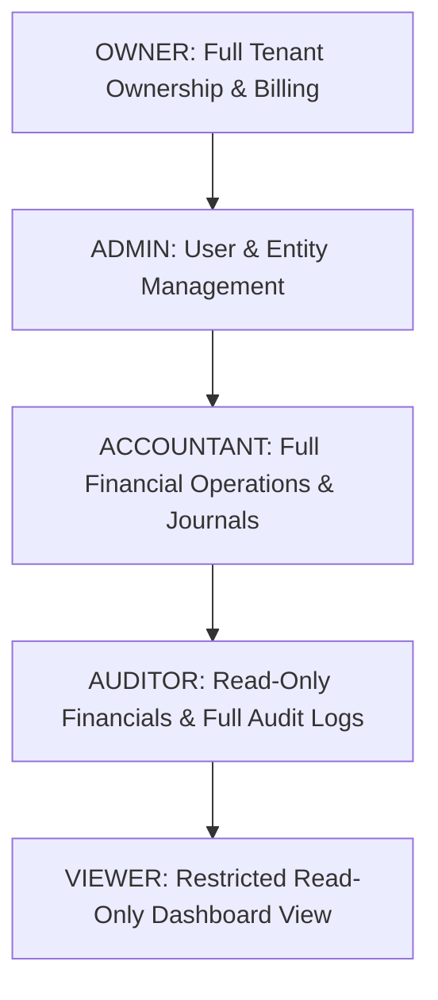

# FINAGROW Role-Based Access Control (RBAC) & Multi-Tenancy
**Document Version:** 1.0.0 (Phase 1)  

---

## 1. Role Hierarchy & Permission Scope



### Permission Matrix

| Capability / Action | OWNER | ADMIN | ACCOUNTANT | AUDITOR | VIEWER |
| :--- | :---: | :---: | :---: | :---: | :---: |
| **Delete / Transfer Organization** | ✅ | ❌ | ❌ | ❌ | ❌ |
| **Manage Subscription & Billing** | ✅ | ✅ | ❌ | ❌ | ❌ |
| **Invite & Manage Users** | ✅ | ✅ | ❌ | ❌ | ❌ |
| **Create & Configure Entities** | ✅ | ✅ | ❌ | ❌ | ❌ |
| **Modify Chart of Accounts** | ✅ | ✅ | ✅ | ❌ | ❌ |
| **Post Journal Entries & Transactions** | ✅ | ✅ | ✅ | ❌ | ❌ |
| **Create Invoices & Vendor Bills** | ✅ | ✅ | ✅ | ❌ | ❌ |
| **Perform Bank Reconciliations** | ✅ | ✅ | ✅ | ❌ | ❌ |
| **View Financial Reports (P&L, Balance Sheet)** | ✅ | ✅ | ✅ | ✅ | ⚠️ *(Filtered)* |
| **View Security & Audit Logs** | ✅ | ✅ | ❌ | ✅ | ❌ |
| **Access FINAGROW AI Assistant** | ✅ | ✅ | ✅ | ✅ | ✅ |

---

## 2. Guard Implementation Details

### `@Roles(...roles: Role[])` Decorator
Decorates controller methods with authorized roles:
```typescript
@Post()
@Roles(Role.OWNER, Role.ADMIN)
async createEntity(...) { ... }
```

### `RolesGuard`
Evaluates the authenticated user's active membership against required roles:
```typescript
const requiredRoles = this.reflector.getAllAndOverride<Role[]>(ROLES_KEY, [
  context.getHandler(),
  context.getClass(),
]);
```

### `TenantGuard` (Multi-Tenant Isolation)
Prevents cross-tenant data leakage by verifying that the authenticated user belongs to the requested organization (`x-organization-id` header or URL parameter). If a user attempts to supply an organization ID where they hold no membership, a `403 Forbidden` exception is thrown immediately.
